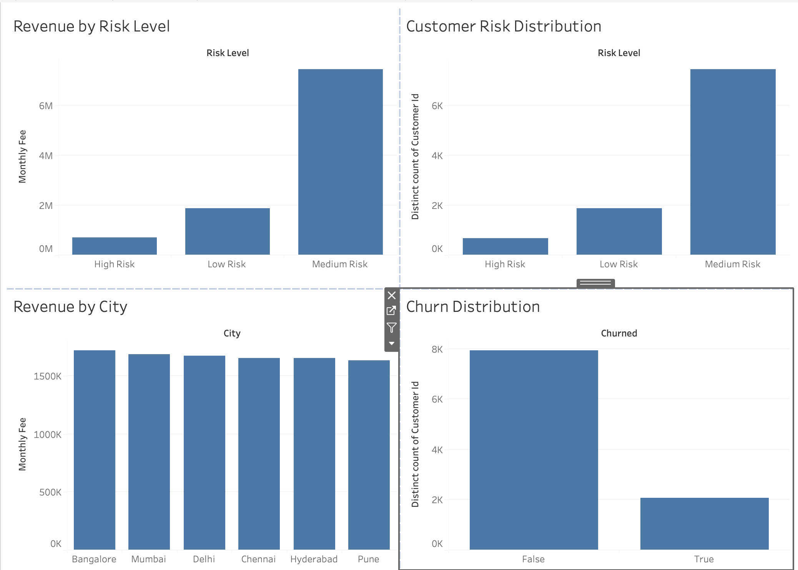
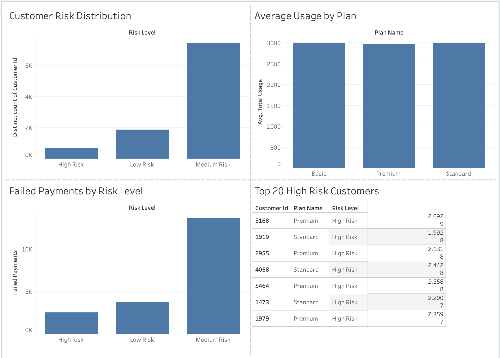

# Customer Churn & Revenue Risk Analytics

## Overview

This project is an end-to-end SQL analytics solution built using PostgreSQL to analyze customer behavior, subscription activity, product usage, payment history, and churn risk.

The goal is to help a subscription-based business identify customers at risk of leaving, estimate revenue exposure, and support data-driven retention strategies.

---

## Business Problem

Customer churn directly impacts revenue and growth.

Business stakeholders want answers to the following questions:

- Which customers are most likely to churn?
- How much revenue is at risk?
- Which subscription plans have the highest risk?
- Which cities contain the largest number of high-risk customers?
- Which customers should be prioritized by retention teams?

---


## Key Results

- Customers analyzed: 10,000
- Payments analyzed: 100,000
- Usage events analyzed: 300,000
- Churn rate: 20.69%
- Revenue generated: ₹80.04M
- Revenue from churned customers: ₹16.64M

## Project Architecture

```text
customers
├── subscriptions
├── payments
├── usage_logs
├── support_tickets
└── customer_churn

customer_health (VIEW)
        │
        ▼
executive_dashboard (VIEW)
```

---

## Dataset Scale

| Table | Records |
|---------|---------:|
| Customers | 10,000 |
| Subscriptions | 10,000 |
| Payments | 100,000 |
| Usage Logs | 300,000 |
| Customer Churn | 10,000 |

**Total Records Analyzed:** 430,000+

---

## Database Schema

### Customers
Stores customer demographic information.

### Subscriptions
Stores subscription plan and pricing details.

### Payments
Stores customer payment history and transaction status.

### Usage Logs
Stores product usage activity and engagement metrics.

### Customer Churn
Stores churn labels used for retention analysis.

---


## Dashboard Preview

### Executive Overview



### Customer Health



### Revenue At Risk


customers
    |
    ├── subscriptions
    ├── payments
    ├── usage_logs
    ├── support_tickets
    └── customer_churn

## SQL Concepts Used

- Primary Keys
- Foreign Keys
- Joins
- Aggregations
- GROUP BY
- CASE Statements
- Common Table Expressions (CTEs)
- Views
- Window Functions (`RANK`)
- Data Modeling
- Business KPI Analysis

---

## Customer Health Model

A reusable SQL view was created to calculate customer health metrics.

Metrics include:

- Total Product Usage
- Failed Payments
- Customer Risk Classification

Risk Categories:

- High Risk
- Medium Risk
- Low Risk

---

## Executive Dashboard View

The executive dashboard view combines customer health data with subscription and churn information.

Business stakeholders can use it to:

- Identify high-risk customers
- Estimate revenue at risk
- Monitor customer engagement
- Support retention campaigns

---

## Key Business Metrics

### Churn Rate

Measures the percentage of customers who have churned.

### Revenue at Risk

Estimates potential revenue loss from high-risk customer segments.

### Customer Health Score

Identifies customers requiring intervention.

### Subscription Performance

Analyzes plan-level customer behavior and engagement.

---

## Technologies Used

- PostgreSQL
- SQL
- Git
- GitHub
- Power BI

---

## Sample Analytics Questions Answered

- What is the overall churn rate?
- How much revenue comes from churned customers?
- Which cities generate the highest usage?
- Which customers are most at risk of churn?
- Which subscription plans have the highest revenue exposure?
- Who are the top customers that should be targeted for retention?

---

## Project Structure

```text
customer-churn-analytics/
│
├── schema/
│   └── create_tables.sql
│
├── data_generation/
│   └── generate_data.sql
│
├── analytics/
│   ├── customer_health.sql
│   └── executive_dashboard.sql
│
├── dashboard/
│
├── screenshots/
│
└── README.md
```

---

## Future Improvements

- Advanced churn prediction using Python
- Customer lifetime value (CLV) analysis
- Automated ETL pipelines
- Real-time dashboard integration
- Predictive customer segmentation

---

## Author

Built as a portfolio project to demonstrate SQL, data modeling, business analytics, and customer retention analysis skills.